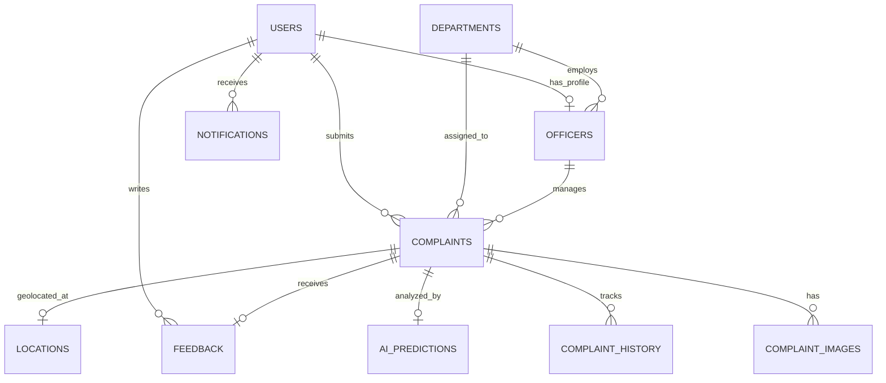

# CivicEye - Database Entity Relationship (ER) Diagram & Schema

## Database Tables Overview

| Table Name | Primary Key | Foreign Keys | Key Attributes | Description |
|---|---|---|---|---|
| `users` | `id` | None | `email`, `hashed_password`, `role`, `reward_points`, `badge` | Stores Citizen, Officer, and Admin account credentials & reward points |
| `departments` | `id` | None | `name`, `code`, `contact_email`, `contact_phone` | Stores municipal departments (Highways, Municipality, Water, Electricity, PWD) |
| `officers` | `id` | `user_id`, `department_id` | `employee_id`, `badge_number`, `designation` | Government officers linked to departments |
| `complaints` | `id` | `citizen_id`, `department_id`, `officer_id` | `tracking_code`, `category`, `priority`, `status`, `latitude`, `longitude` | Primary complaint records |
| `complaint_images` | `id` | `complaint_id` | `image_url`, `image_type` (CITIZEN, BEFORE, AFTER) | Photo evidence stored for complaints |
| `complaint_history` | `id` | `complaint_id` | `status`, `notes`, `updated_by_name`, `timestamp` | Audit log of status transitions |
| `ai_predictions` | `id` | `complaint_id` | `is_genuine`, `predicted_category`, `confidence_percentage`, `predicted_priority` | Raw output of AI inference model |
| `notifications` | `id` | `user_id` | `title`, `message`, `is_read`, `created_at` | Push & in-app alerts |
| `feedback` | `id` | `complaint_id`, `user_id` | `rating` (1-5), `comments` | Citizen star ratings and reviews |
| `chat_messages` | `id` | `user_id` | `sender`, `message`, `timestamp` | Conversational history with AI Chatbot |
| `locations` | `id` | `complaint_id` | `latitude`, `longitude`, `address`, `zone_name` | GIS spatial data |
